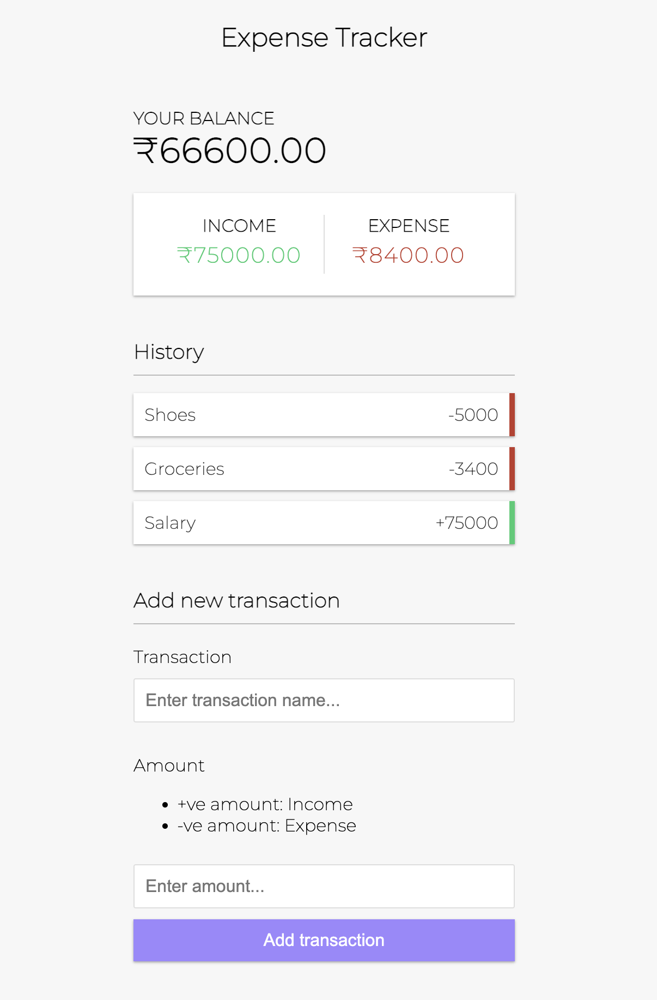

> Click on the link below to view the App.

# [Expense Tracker]()
### Minimal web app to manage and track your expenses easily.

Current Features:
* Minimal yet responsive UI.
* Add and manage your expenses.
* Remove expense entry.
* Save expense items to local storage.
* Expenses persist even after reloading the web app.

Features to add:
* Edit expense entry without removing it.

### Screenshot
!